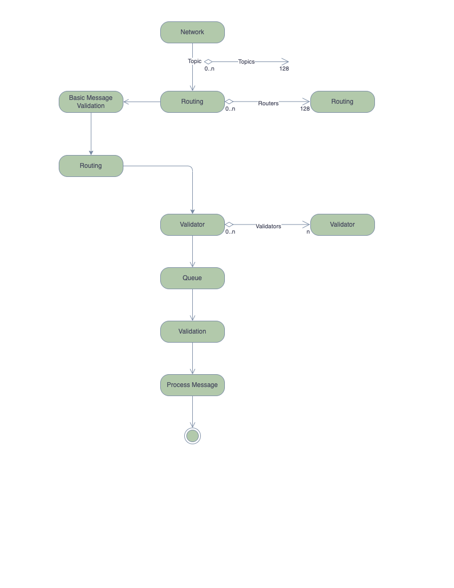

# SSV Specifications - Messaging

| Authors                                 | Status | Last Revision |
|:----------------------------------------|:-------|:--------------|
| [@niv-blox](https://github.com/nivBlox) | WIP    | FEB 14        |

This document contains the messaging specification for `SSV.Network`.

## Overview

- [ ] [Fundamentals](#fundamentals)
  - [ ] [Stack](#stack)
  - [ ] [P2P Network](#p2p-networking)
  - [ ] [Life Cycle](#life-cycle)
  - [ ] [Message Router](#messages-Router)
- [ ] [Wire](#wire)
  - [ ] [IBFT message](#ibft-message)
- [ ] [Validation](#validation)
  - [ ] [IBFT](#ibft)
  - [ ] [Decided](#decided)
  - [ ] [Sync](#sync)
## Fundamentals

### Stack

SSV supports a large amount of messages from the network in order to reach consensus between all committee’s operators
All messages need to be handled for each validator in parallel.

### P2P Networking

p2p networking should work as a "black box" for the messages handler. Where the messaging processor gets the msgs from.

### Life Cycle 

### Messages Router
Messages can come in various times, even next round's messages can come "early" as other nodes can change round before this node.
The messages processing should be "smart & dynamic". messages will be processed by multi layer decisions
1. **Sequence number** - always priorities validator's state seqNum. until seqNum is decided no further message will be processed.   
2. **Stage** - messages will be processed by time of arrival unless there are quorum of the same stage (prepare, commit). in that case processor will "push" the quorum msg's forward. 
3. **Round** - Same as **Stage**, current state round have priority unless there is a quorum for a higher round.  

## Wire

### IBFT Message
Sync
IBFT
Pre-prepare
Prepare
Commit
Decided
Signature

## Validation
### IBFT
Each IBFT message goes through basic validation.
- Message
  - Checks sign message is not nil
  - Checks message is not nil
- Type
  - Checks if type is expected
- Lambda
  - Checks if lambda equal to share state lambda
- Sequence Number
  - Checks if seqNum is equal to share state seqNum
- BLS
  - Get all publicKeys by the message signer id’s
  - Verify all signers are unique
  - Aggregate all pk’s
  - Deserialize message signature
  - Verify pk’s and root bytes with sig

#### Pre-Prepare
- Round
  - Validate round from state is equal to message round
- **UponPrePrepareMsg** Algorithm 2 IBFTController pseudocode for process pi: normal case operation
upon receiving a valid ⟨PRE-PREPARE, λi, ri, value⟩ message m from leader(λi, round) such that:
JustifyPrePrepare(m) do
set timer i to running and expire after t(ri)
broadcast ⟨PREPARE, λi, ri, value⟩

#### Prepare
- Round
  - Validate round from state is equal to message round
- Quorum Check

#### Commit
- Quorum Check
- Flow

   //TODO add flow diagram

#### Change Round
- Validate
  - Check if msg is nil
  - Check if Prepared value is nil
  - Check if justification message type is not `prepare`
  - Validate msg sequence number with justification msg
  - Validate msg round with justification msg
  - Validate data.prepared round with justification msg round
  - Validate msg lambda with justification msg lambda
  - Validate data prepared value with justification msg value
  - Validate enough signer id’s is not less than threshold size
  - BLS verify signature
  - **uponChangeRoundPartialQuorum**
  upon receiving a set Frc of f + 1 valid ⟨ROUND-CHANGE, λi, rj, −, −⟩ messages such that:
  ∀⟨ROUND-CHANGE, λi, rj, −, −⟩ ∈ Frc : rj > ri do
  let ⟨ROUND-CHANGE, hi, rmin, −, −⟩ ∈ Frc such that:
  ∀⟨ROUND-CHANGE, λi, rj, −, −⟩ ∈ Frc : rmin ≤ rj
  ri ← rmin
  set timer i to running and expire after t(ri)
  broadcast ⟨ROUND-CHANGE, λi, ri, pri, pvi⟩
  - Validate Round
  - **uponChangeRoundFullQuorum**
    upon receiving a quorum Qrc of valid ⟨ROUND-CHANGE, λi, ri, −, −⟩ messages such that
    leader(λi, ri) = pi ∧ JustifyRoundChange(Qrc) do
    if HighestPrepared(Qrc) ̸= ⊥ then
    let v such that (−, v) = HighestPrepared(Qrc))
    else
    let v such that v = inputValue i
    broadcast ⟨PRE-PREPARE, λi, ri, v⟩

### Decided

- Message
  - Checks sign message is not nil
  - Checks message is not nil
- Type
  - Checks if type is expected
- BLS
  - Get all publicKeys by the message signer id’s
  - Verify all signers are unique
  - Aggregate all pk’s
  - Deserialize message signature
  - Verify pk’s and root bytes with sig
- Quorum
  - Validate enough signer id’s is not less than threshold size 
- Flow

   //TODO add flow diagram 

### Sync

